# n8n 安裝與啟動指南 - 以 Docker Desktop 為例

## 下載與安裝 Docker Desktop

1. 打開瀏覽器並前往 Docker Desktop 官方頁面：`https://www.docker.com/products/docker-desktop`

2. 選擇適合的作業系統版本。
   - Windows 使用者請下載 Windows 版安裝程式，這裡以 AMD64 為例。
    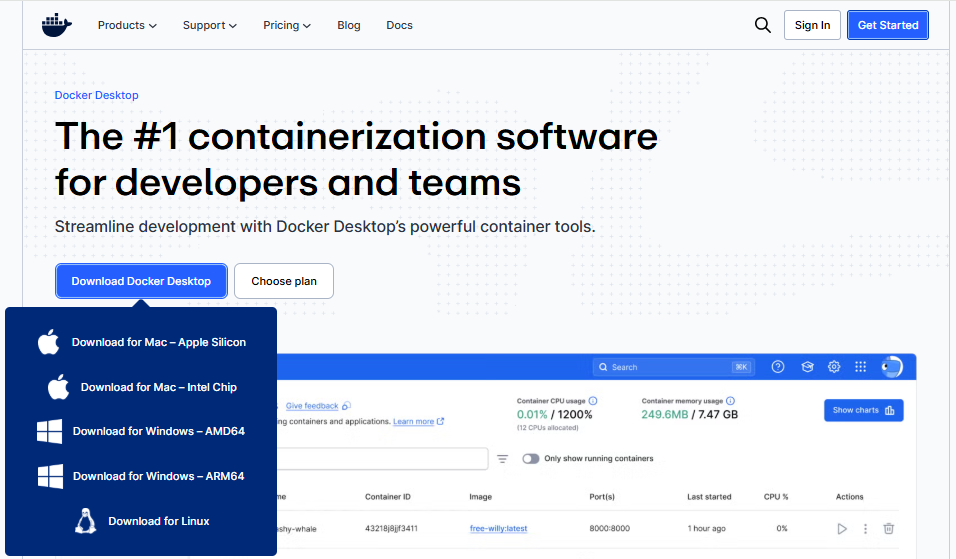
    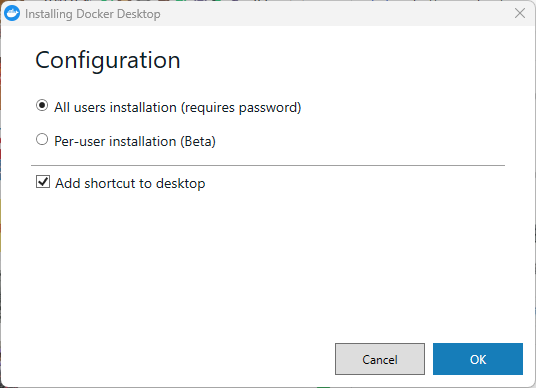
    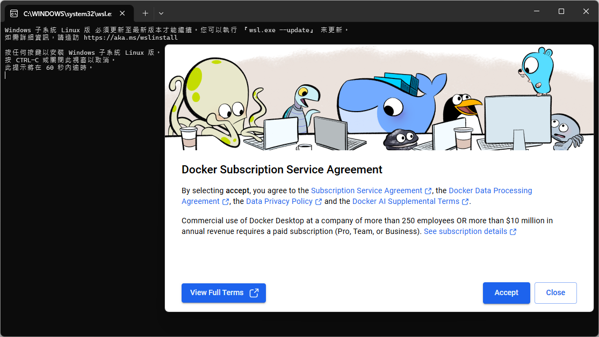
3. 下載完成後，執行安裝程式。如果系統提示要更新/啟用 WSL 2，請依照指示如下載 [Try Again]、重新啟動電腦 [Close and Reopen]。
    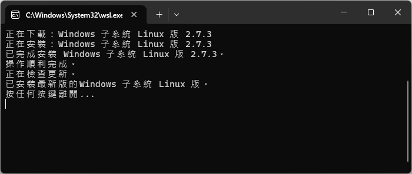
    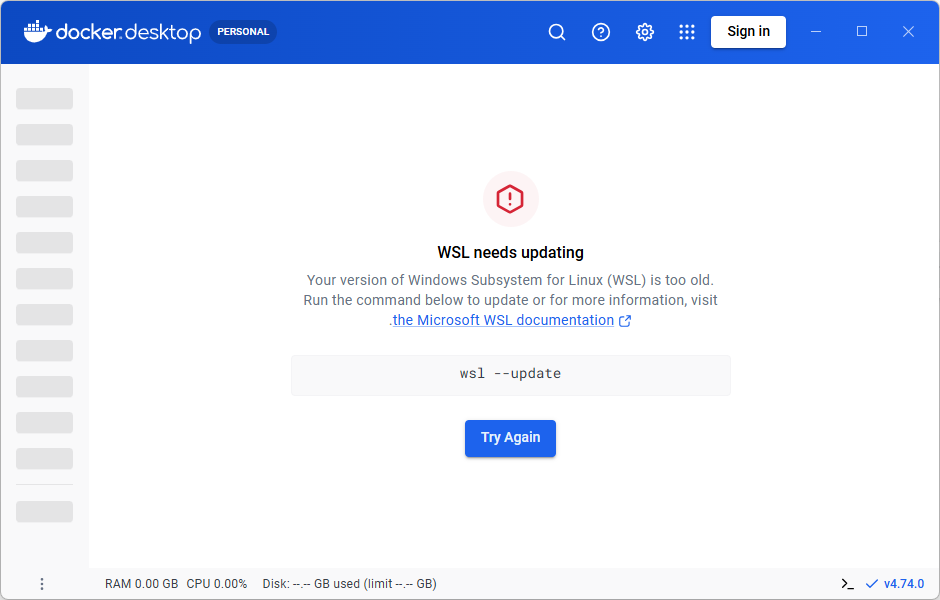

4. 安裝完成後，啟動 Docker Desktop。
   - 如果首次使用，Docker Desktop 可能會提示你登入 Docker Hub 帳號，這一步驟通常可跳過。

5. 確認 Docker Desktop 已能成功啟動。
   - 在系統列可以看到 Docker 圖示。
   - 打開命令提示字元或 PowerShell，輸入 `docker -v` 確認 Docker 版本。
    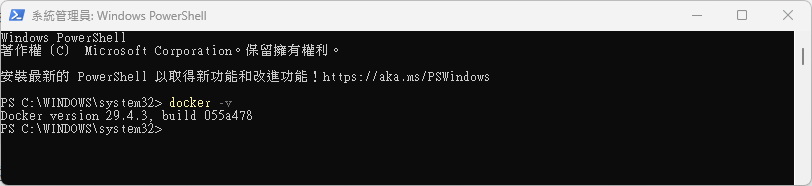
    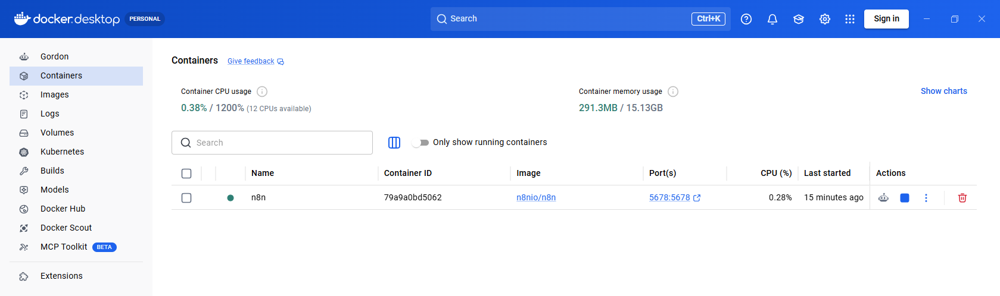

> 更新 WSL 失敗 (WSL update failed) 的排除方式
> - Mac 用戶：重新開機
> - Windows 用戶：
>   1. 重新啟動電腦
>   2. 若無法排除，在終端機輸入 `wsl --update` 或 `wsl --install`
>   3. 若仍無法排除，到【控制台 > 程式集 > Windows 子系統 Linux版】勾掉，再到 [WSL 官方 Github](https://github.com/microsoft/WSL/releases) 下載最新版 .msi 安裝檔，最後重新啟動電腦。


## 下載並啟動 n8n

> 目前建議透過 Docker 來執行 n8n，這樣比較穩定且免安裝 Node.js 環境。不只安裝速度也較快，對 PC 的作業系統影響也會較小。

1. 執行以下指令以下載並啟動 n8n：
   ```powershell
   docker run -it --rm --name n8n -p 5678:5678 -v n8n_data:/home/node/.n8n docker.n8n.io/n8nio/n8n
   ```
   - `-p 5678:5678`：將本機的 5678 連接埠對應到 n8n 容器。
   - `-v n8n_data:/home/node/.n8n`：將 Docker volume `n8n_data` 掛載為 n8n 的設定與資料儲存位置。

    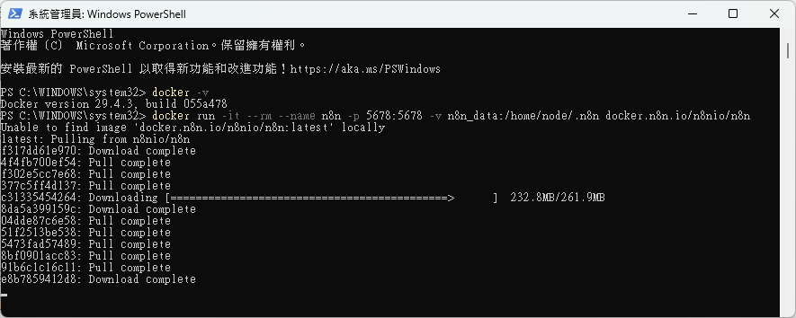
    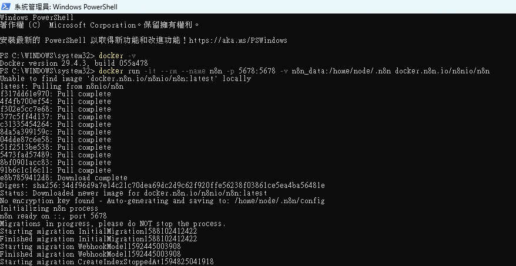

2. 成功安裝並啟動後，開啟瀏覽器並前往：`http://localhost:5678`
    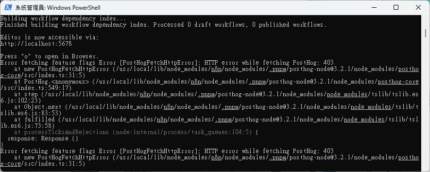
3. 輸入使用者資訊 (<--必要)，並透過電郵取得序號 (<--可選)。(這些輸入資料只會存在當前的 PC，不會與其他電腦分享)
    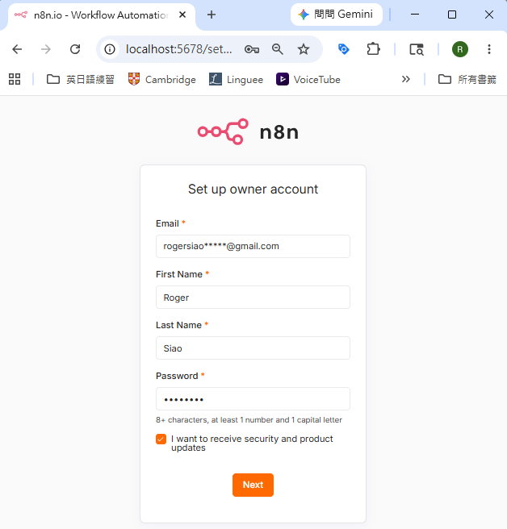
    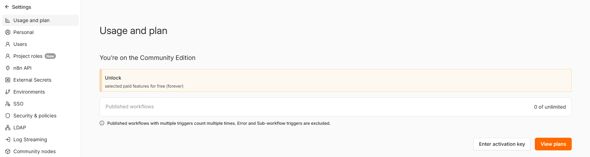
3. 在瀏覽器中即可看到 n8n 的使用者介面，開始建立工作流程。
    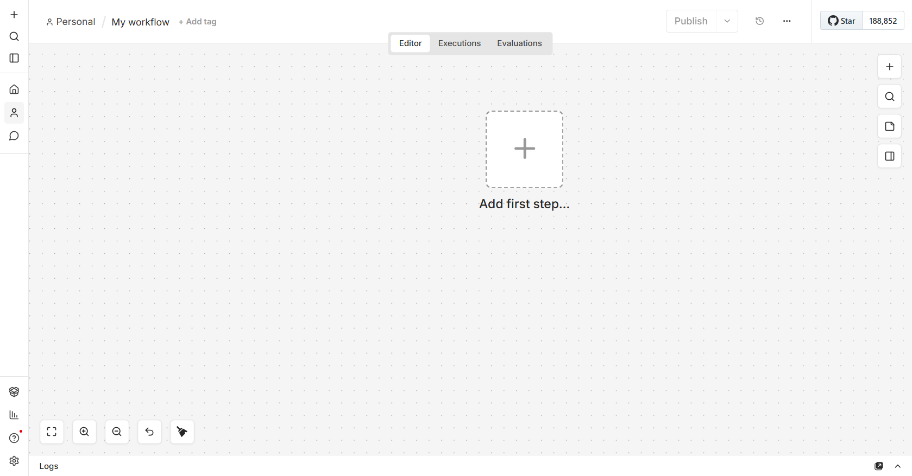

## 關閉 n8n

如果你是透過 Docker 啟動 n8n，以下兩種方法都可以關閉它：

- 透過命令列停止：
  ```powershell
  docker stop n8n
  ```
  這會停止名稱為 `n8n` 的容器。

- 透過 Docker Desktop：
  1. 開啟 Docker Desktop。
  2. 在「Containers / Apps」頁面找到 `n8n` 容器。
  3. 點選 `Stop` 按鈕停止容器。

## 重新啟動 n8n

如果你想重新啟動已停止的 `n8n` 容器，可以：

- 直接重新執行最初的啟動指令：
  ```powershell
  docker run -it --rm --name n8n -p 5678:5678 -v n8n_data:/home/node/.n8n docker.n8n.io/n8nio/n8n
  ```
  - 如果先前已使用 `--rm` 啟動，容器停止後會被移除，此時必須重新執行此指令。

- 或者使用 Docker Desktop 重新啟動：
  1. 開啟 Docker Desktop。
  2. 在「Containers / Apps」找到 `n8n` 容器。
  3. 點選 `Start` 或 `Restart`。

## 進階建議

- 若想讓 n8n 長期運行，建議改用 Docker Compose 或建立 Windows 服務來管理容器。亦可考慮放上雲端空間使用。
- 若需要永久儲存資料，請確認 `-v` 掛載路徑已正確設定，避免容器刪除後資料遺失。
