# n8n - 台鐵時刻表查詢與搭乘規劃自動化整理

## 1. 專案概述

本專案針對台灣鐵路公司山線與海線交會路段，利用現行時刻表進行資料查詢、比對與搭乘規劃。

**專案目標**：透過 n8n 地端自動化流程，整理直達與轉乘列車的最新資訊，補足台鐵官網時刻表查詢的不足。專案重點在於整合跨路線時刻資料，根據起迄站簡化複雜路線排點，輸出適合一般乘客參考的山海線搭乘與轉乘方案。

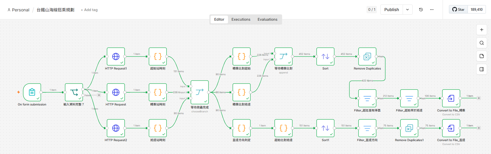

## 2. 現況分析與設計概念

- **現況分析**
    1. **轉乘查詢資料不夠完整**：官網的轉乘時間只能選取 20、30、50 分鐘以內，同時只顯示兩班次大於 5~10 分鐘的成功媒合轉乘班次，故無法取得轉乘站完整且可用的班次列表。
    2. **畫面資料無法下載編輯**：查詢結果畫面中，使用多個 UI 元件有助於使用者分階取得資訊，但不利於複製車次及時刻細部資訊，用於地端檔案中的搭程規劃資料彙整與統計。
    3. **直達與轉乘條件輸入過於複雜**：若使用者想用手機確認如何搭乘，不管是直達還是轉乘，通常希望越快越好，但目前表單多達 10 個輸入欄位，可能無法達到快速查詢的效果。


    <details><summary>🔍 台鐵公司官網，「依時刻」資訊顯示方式。(有限直達、指定轉乘站的功能)</summary>
        
    - 搭乘限直達 (不轉乘)：[現況_限直達.pdf](resources/n8n_台鐵山海線_現況02_限直達.pdf)
    
        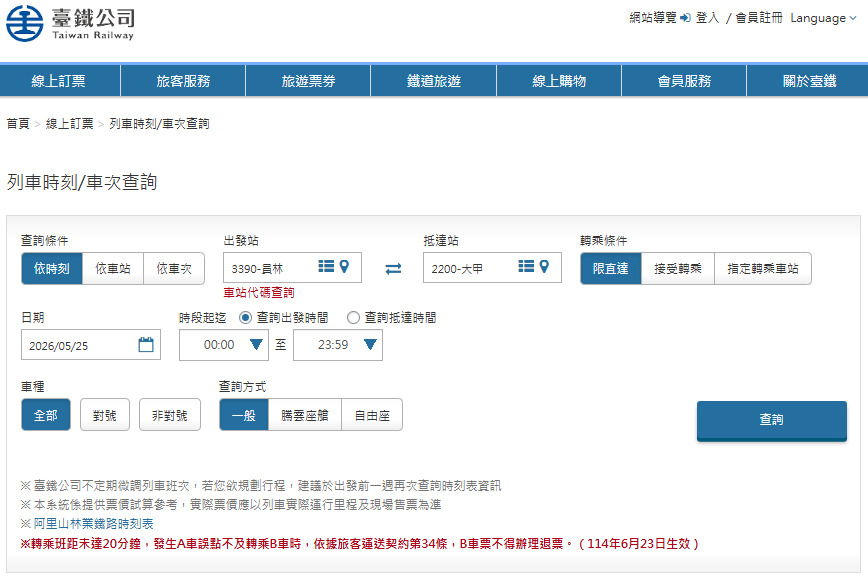
        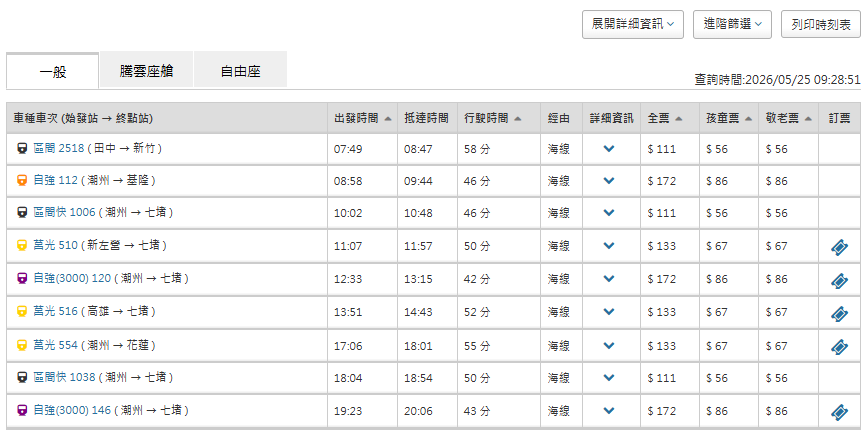
        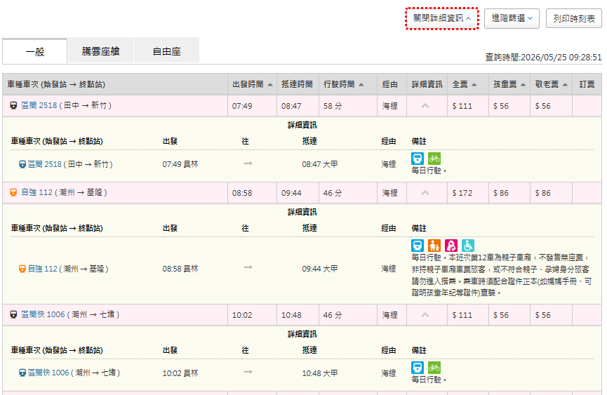

    - 搭乘指定轉乘站：[現況_指定轉乘.pdf](resources/n8n_台鐵山海線_現況01_指定轉乘.pdf)
    
        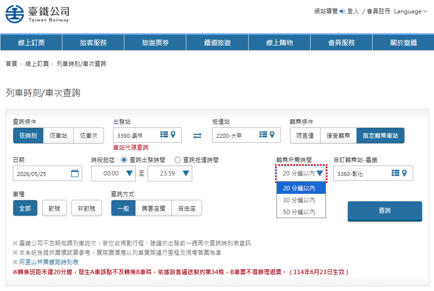
        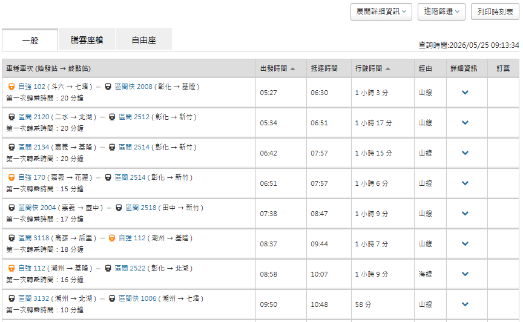
        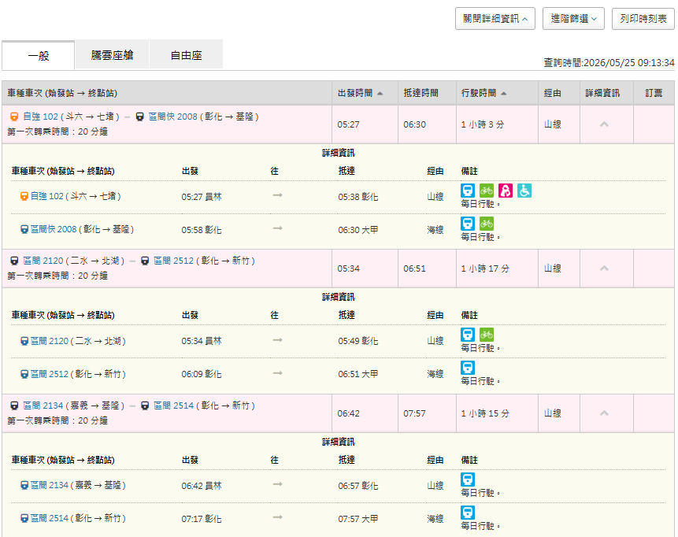
      
    </details>
    
    <details><summary>🔍 台鐵公司官網，「依車站」資訊顯示方式。(再分成順行、逆行頁籤)</summary>
        
    - 選擇單一站別：[現況_站別.pdf](resources/n8n_台鐵山海線_現況03_站別.pdf)
    
        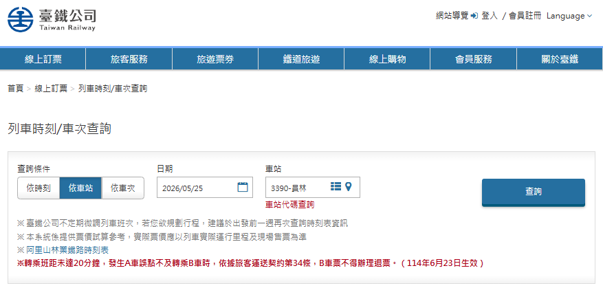
        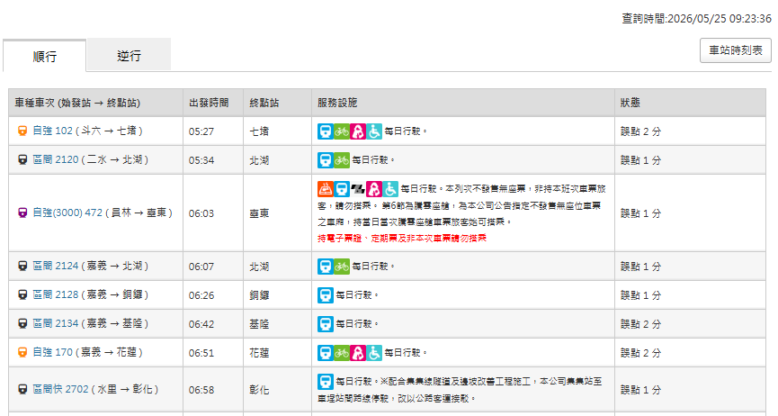
        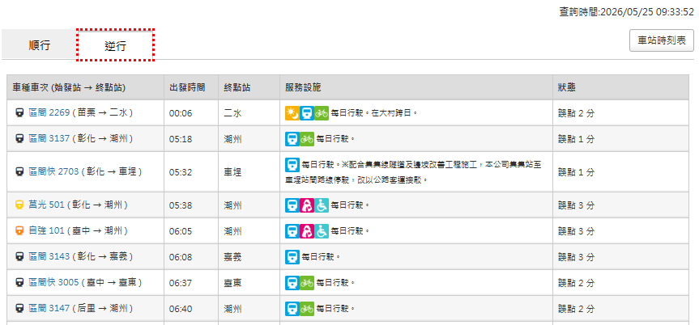    
    </details>
    
- **設計概念**
    - **網頁爬蟲資料擷取**：使用爬蟲取得最新時刻表資料，確保規劃依據為最新營運資訊。
    - **單點故障快速定位**：流程設計具備錯誤監控與節點檢測機制，若 RPA 發生單點故障，可迅速定位問題來源。
    - **JS 資料清洗與比對**：使用 JavaScript 進行時刻表與站間關係的資料清洗，讓系統更準確理解站別間的轉乘邏輯。

<details><summary> ✨ 預期產出結果 ✨：同時取得 2 份 csv 檔案。第 1 份是「轉乘時刻表」，第 2 份是「直達時刻表」。[點我，看更多 👀]</summary>

> 執行 RPA 遇到的第一個節點，需要由使用者手動輸入條件：
> - 範例：若要搭火車前往「**大甲站**」，把「**員林站**」作為起始站，轉乘站是「**彰化站**」。
> - 只要在彈出的表單輸入 4 個欄位，包括 **搭乘日期、轉乘站、起始站、抵達站**，即可自動抓取最新的時刻資料。

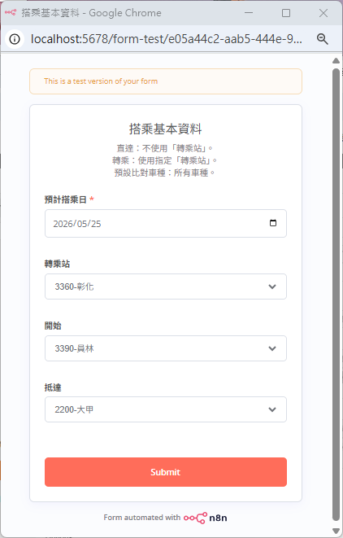

> 當跑完這一整個 RPA 流程，大約 5 ~ 10 秒鐘，即可下載下面這 2 份 csv 檔案：
> 1. **直達時刻表** (右)
>     - 以起始站 (出發站) 的時刻表為基礎，比對抵達站是否也有停靠。
>     - 第 13、17、21 列的班次資料 (區間 2518、自強 112、區間快 1006) 皆為直達車，員林、大甲皆有停靠。
>     - 若該班次不發售無作票 (不可用電子票證搭乘)，會在最右邊一欄以「▲ reserved」另作標註。
> 2. **轉乘時刻表** (左)
>     - 以轉乘站的時刻為基礎，分別比對起始站、抵達站是否也有停靠。
>     - 第 11 ~ 14 列的班次有 4 班 (區間 2134、自強 170、區間快 2702、區間 2514)，前面 3 班次都可由彰化轉車前往大甲。(台鐵官網並未列出「區間快 2702 -> 區間 2514」的轉乘方式?! )
>     - 第 18 ~ 19 列的區間 2518，雖然它是直達車，但也會被列在轉乘時刻表，故使用者可依需求快速確認：該時段搭車是否該安排轉乘。

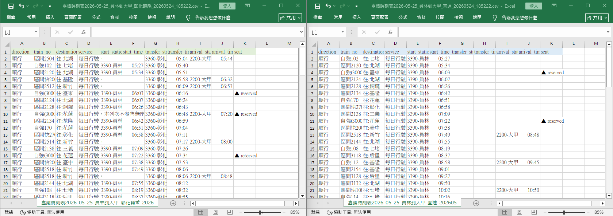

</details>

🕸 **馬上查看**：測試範例產出的 csv 檔案 (由於台鐵預計於 2026-07-01 實施改點，所以分別使用 2 個日期測試)
  - 檔案 1: [臺鐵時刻表2026-05-25_員林到大甲_彰化轉乘](output/臺鐵時刻表2026-05-25_員林到大甲_彰化轉乘_20260524_185222.csv)
  - 檔案 2: [臺鐵時刻表2026-05-25_員林到大甲_直達](output/臺鐵時刻表2026-05-25_員林到大甲_直達_20260524_185222.csv)
  - 檔案 3: [臺鐵時刻表2026-07-06_員林到大甲_彰化轉乘](output/臺鐵時刻表2026-07-06_員林到大甲_彰化轉乘_20260524_183553.csv)
  - 檔案 4: [臺鐵時刻表2026-07-06_員林到大甲_直達](output/臺鐵時刻表2026-07-06_員林到大甲_直達_20260524_183553.csv)
    
## 3. 系統架構與資料流程

1. 輸入基本條件：以表單方式收集搭乘日期、轉乘站、起站、迄站等資訊，提供自動化查詢所需資料。
2. 輸入驗證與日期處理：使用 `On form submission` 節點取得時戳，轉換為 `Asia/Taipei` 時區，並以時間比較及數字轉換檢查搭乘日與班次時間的合法性。
3. 來源擷取：從指定資料來源讀取 TRC 檔案內容，或透過台鐵 API / HTTP request 查詢站別時刻表。
4. 資料解析：將取得的 HTML / 原始資料解析成可處理的中間格式（例如 JSON），並補上行駛方向、無座票標記等欄位。
5. 資料清洗與合併：使用 `Filter`、`Sort`、`Remove Duplicates`、`Merge` 等節點進行欄位標準化、空值處理、重複資料移除與多來源合併。
6. 轉檔處理：依需求進行欄位轉換、欄位重命名與資料格式轉換，並維持後續 `Convert to File` 所需的 JSON 欄位順序。
7. 同步控制與檔案下載：利用 `Merge` 節點確保跨來源資料全部到達後再輸出 CSV，並以起站、迄站、轉乘站、搭乘日與下載時戳建立檔名。
8. 結果輸出：將結果匯出至指定儲存位置或推送至下游系統。


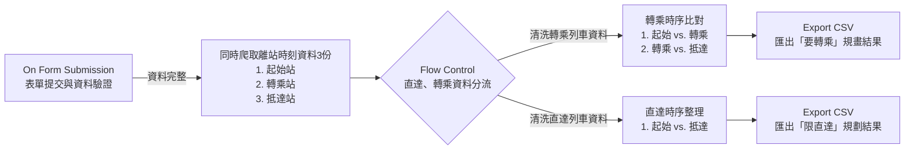

## 4. ETL 步驟與資料集處理規則

> 本專案使用 n8n GUI + JS 進行資料清洗

1. 自訂表單欄位驗證條件 (if not, 不處理)
    - 起站與迄站不可相同。
        ```n8n GUI
        {{ $json['開始'] }} is not equal to {{ $json['抵達'] }}
        // 3390-員林 is not equal to 2200-大甲
        ```
    - 預計搭乘日為必填，且可查詢日期限制為過去 7 天內，且不超過未來 3 個月。
        ```n8n GUI
        {{ $json["預計搭乘日"] }} is after or equal to {{ DateTime.fromISO($json["submittedAt"]).setZone('Asia/Taipei').minus({ days: 7 }) }}
        AND
        {{ $json["預計搭乘日"] }} is before or equal to {{ DateTime.fromISO($json["submittedAt"]).setZone('Asia/Taipei').plus({ months: 3 }) }}
        // 2026-06-01T00:00:00.000Z is after or equal to [DateTime: 2026-05-23T07:54:34.922+08:00]
        // 2026-06-01T00:00:00.000Z is before or equal to [DateTime: 2026-08-30T07:54:34.922+08:00]
        ```
2. 指定爬蟲資料範圍
    - 每次爬蟲只能指定單一車站(開始/轉乘/抵達)、單一日期。
        ```n8n GUI
        https://www.railway.gov.tw/tra-tip-web/tip/tip001/tip112/querybystationblank?rideDate={{ DateTime.fromISO($json["預計搭乘日"]).toFormat('yyyy/MM/dd') }}&station={{ $json["開始"] }}
        https://www.railway.gov.tw/tra-tip-web/tip/tip001/tip112/querybystationblank?rideDate={{ DateTime.fromISO($json["預計搭乘日"]).toFormat('yyyy/MM/dd') }}&station={{ $json["轉乘站"] }}
        https://www.railway.gov.tw/tra-tip-web/tip/tip001/tip112/querybystationblank?rideDate={{ DateTime.fromISO($json["預計搭乘日"]).toFormat('yyyy/MM/dd') }}&station={{ $json["抵達"] }}
        ```
    - 所有爬蟲資料完成後，將有 3 份資料集暫存系統。

3. 比對可用班次與車站排點 (前提：資料集 3 份都要完整爬完)
    - 列出可換乘車次順序
        - [比對兩站的列車時刻內容](js/clean_trc_raw_data.js)
        - 若允許轉乘，兩兩車站時刻比對，以轉乘站時刻比對起始站，再以轉乘站時刻比對抵達站。
        - 若不轉乘(限直達)，只以抵達比對起始。
        - 前者當主表是參照時刻表，後者附表是比對時刻表。
        
        > 原設計：比對同一車站不同車次間的可換乘時差 ❌
        > 1. 原本有計畫要精細比對搭乘資訊，如轉乘站 A 車抵達時刻、B 車出發時刻的可換乘時間，但礙於爬蟲結果過大將影響 RPA 效能，而且台鐵常拿排點緩衝抵銷誤點的習慣，故決定都只用「抵達時刻」精準比對。
        > 2. 某一站恰為某班次的終點站與始發站，該站的車站時刻表都會列出，放在「出發時間」這一欄。i.e. 終點站的「出發時間」是該班車的抵達時刻。❇️
            
    - 判別行車方向
        - [確認站別與列車方向關聯](js/check_trc_direction.js)
        - 建立「行車方向參照表」✳️，能定義行車方向。如台中/豐原/沙鹿/大甲/追分/成功往南都取逆行，往北都都視為順行。

        > 原設計：以車站編號、車次編號規則確認行車方向 ❌
        > 1. 台鐵西部的車站編號，由北往南是逐漸變大，山線(台中線)車站大於海線車站。
        >   - 如：海線 `2200-大甲`、`2230-沙鹿`，山線 `3340-新烏日`、`3300-臺中`，縱貫線(山海線匯合點) `1250-竹南`、`3360-彰化`。
        > 2. 台鐵西部的逆順行，逆行等於南下，順行等於北上。
        >   - 如：`區間 2501 (大甲→彰化)` 在大甲 ~ 彰化皆列為逆行列車，但 `區間 2601 (大甲→豐原)` 在大甲 ~ 追分是逆行，成功 ~ 台中 ~ 豐原改為順行。
        > ==> 既然無法拿車站編號比大小分辨行車方向，只好根據「起迄站」的「南北相對位置」自建資料組，正確判斷山海線列車的順逆行。

4. 篩除與排序預計輸出的資料
    - 修改輸出資料欄位寫入順序
        - 請先參考 [資料整理與格式化說明](#5-3-資料整理與格式化)

    - 建立輸出資料集的篩選機制
        - 移除不匹配班次，開始站/抵達站任一站不為空字串。 
            ```n8n GUI
            {{ $json.start_station }} is not empty
            OR
            {{ $json.arrival_station }} is not empty
            ```

        - 不轉乘(限直達)清單：如果仍要列出起始站/終點站列車，只能仰賴這張「行車方向參照表」參照表，篩選並留下正確方向的車班。✳️
            ```n8n GUI
            {{ $json.direction }} is equal to {{ $('直達方向判定').first().json["直達方向"] }}
            ```

        - 要轉乘清單：由於已篩除了兩兩比對後、沒有同時存在的班次，資料列表只會留下兩站都有出發時刻的班次，故能根據兩站的「出發時間」先後順序比大小。❇️
            ```n8n GUI
            {{ Number($json.transfer_time.replace(':', '')) }} is greater than {{ Number($json.start_time.replace(':', '')) || 0 }}
            AND
            {{ Number($json.transfer_time.replace(':', '')) }} is less than {{ Number($json.arrival_time.replace(':', '')) || 2359 }}
            ```
        
    - 排序清單內的資料，並移除重複項
        - 不轉乘(限直達)清單：直接按照「起始站」的「出發時刻」正序排序。
        - 要轉乘清單：先合併 2 份資料集 (Append 1.轉乘比起始站 + 2.轉乘站比對抵達站)，再按照「轉乘站」的「出發時刻」、「車次」進行正序排序。
        - 最後都要移除重複項。

## 5. 實作 RPA 重點技術

### 5-1. 日期與時區應用
- 使用 `On form submission` 節點產生的時戳，透過 `.setZone('Asia/Taipei')` 轉換成台灣時區，並以 `.plus()` / `.minus()` 計算動態時間範圍。
    ```n8n
    {{ DateTime.fromISO($json["submittedAt"]).setZone('Asia/Taipei').minus({ days: 7 }) }}
    ```
- 比較時間大小的方式：可直接使用 `hh:MM` 格式搭配 `is after` / `is before`，也可將時間強制轉成數字，再以 `is greater than` / `is less than` 判斷。
    - 例如：```{{ Number($json.transfer_time.replace(':', '')) }}```

### 5-2. 網頁爬蟲
- 取得站別時刻表的 API 與網址格式：輸入下方網址可取得順行與逆行完整表格資訊，適用於 HTTP request 節點的 GET 請求，參數為搭乘日 `yyyy/MM/dd` 與站別代號-名稱。
   ```n8n
   https://www.railway.gov.tw/tra-tip-web/tip/tip001/tip112/querybystationblank?rideDate={{ DateTime.fromISO($json["預計搭乘日"]).toFormat('yyyy/MM/dd') }}&station={{ $json["開始"] }}
   ```
- 正確解析 HTML 並儲存成 JSON：使用 Code 節點將原始欄位（車種車次、出發時間、終點站、設施服務、狀態）轉成 JSON，並補上行駛方向與無座票資訊。
    ```JS
    direction: direction,                                                   // 順行、逆行
    train_no: trainNo,                                                      // 車種車次
    departure_station: $('On form submission').first().json["開始"],        // 開車車站
    departure_time: (actualDataTds[0] || "").replace(/^00:/, "24:"),        // 開車時間 (00:20 轉 24:20)
    destination_station: actualDataTds[1] ? `往:${actualDataTds[1]}` : "",  // 到達站
    service: actualDataTds[2].replace(/[\r\n\t]+/g, " ").trim() || "",      // 服務設施
    // status: actualDataTds[actualDataTds.length - 1] || ""                // 狀態
    seat: /自強\(3000\)|普悠瑪|太魯閣/.test(trainNo) ? "▲ reserved" : ""     // 不售無座
    ```

    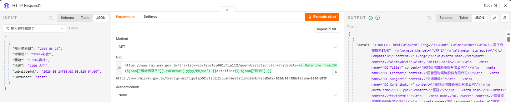
    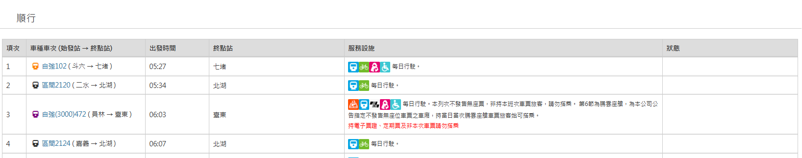
    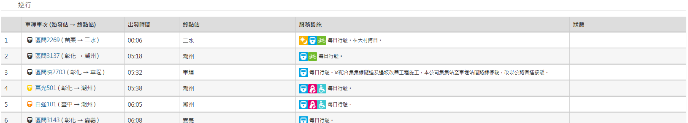
    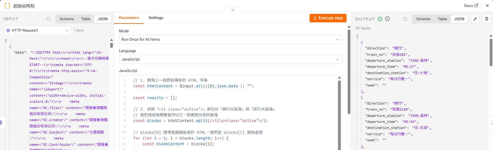
    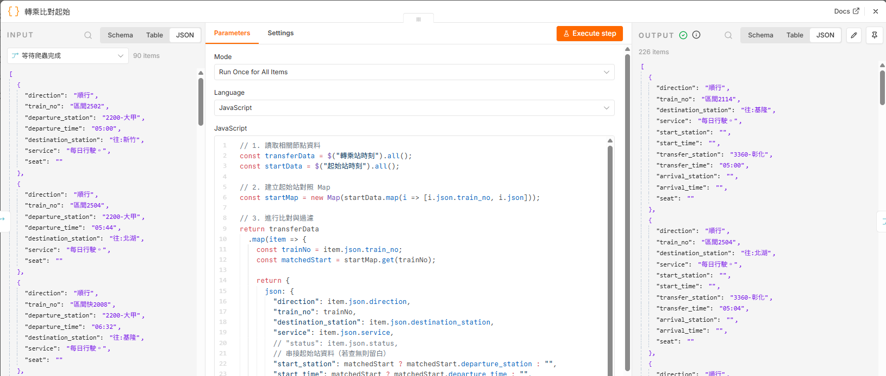

### 5-3. 資料整理與格式化
- 清洗資料並調整欄位順序：後續 `Convert to File` 節點會直接將 JSON 轉成 CSV。清洗時務必要維持欄位格式與欄位順序與 JSON key 一致。
    ```JS
    json: {
        "direction": item.json.direction,
        "train_no": trainNo,
        "destination_station": item.json.destination_station,
        "service": item.json.service,
        // "status": item.json.status,
        // 串接起始站資料（若查無則留白）
        "start_station": matchedStart ? matchedStart.departure_station : "",
        "start_time": matchedStart ? matchedStart.departure_time : "",
        // 轉乘站
        "transfer_station": item.json.departure_station,
        "transfer_time": item.json.departure_time,
        // 抵達站在此階段留白
        "arrival_station": "",
        "arrival_time": "",
        "seat": item.json.seat
      }
    ```
- 常用資料清洗節點：
    - `Filter`：保留符合條件的資料。
    - `Sort`：依指定 key 進行多欄排序。
    - `Remove Duplicates`：移除重複資料列。
    - `Merge`：將多個來源 JSON 合併成單一輸出。
    - `Code`：撰寫 JS 腳本處理更複雜的 JSON 轉換。
        - 範例 1：[解析站別時刻 HTML 文本](js/parse_trc_HTML.js)
        - 範例 2：[比對兩站的列車時刻內容](js/clean_trc_raw_data.js)
        - 範例 3：[確認站別與列車方向關聯](js/check_trc_direction.js)
        - 備註：Docker 環境下 Python 3 使用受限，待確認。

### 5-4. 同步/非同步處理與檔案下載
- 連續串聯多個 `HTTP request` 節點可能造成記憶體不足或讀取異常，並影響執行效率。因此建議將爬蟲節點改為並聯，最後再用 `Merge` 節點合併輸出。
- 確認交叉比對資料的取得時機：若 JS 中調用尚未完成的前置節點，可能產生 `undefined` 錯誤。建議搭配 `Merge` 節點，強制等待所有輸入節點完成後再執行後續邏輯。
    - 不合併資料時使用 Choose Branch 並勾選 `Wait for all Inputs to Arrive`。
    - 合併資料時使用 Append。前者的 `Use Data of Input` 僅會選取輸出資料，實際 item 數量仍依後續節點呼叫的資料集 / 變數為準。

- 下載檔案命名規則：輸出 CSV 檔案時，名稱標示起站、迄站、轉乘站、預計搭乘日與下載時間，方便使用者快速辨識與管理檔案。
    ```n8n
    臺鐵時刻表{{ $('輸入資料完整？').first().json['預計搭乘日'] }}_{{ $('輸入資料完整？').first().json['開始'].split('-')[1] }}到{{ $('輸入資料完整？').first().json['抵達'].split('-')[1] }}_{{ $('輸入資料完整？').first().json['轉乘站'].split('-')[1] }}轉乘_{{ $now.setZone('Asia/Taipei').format('yyyyMMdd_HHmmss') }}.csv
    ```

## 6. 後續擴充建議

- 加入通知機制：當流程失敗或完成時發送通知。
- 強化驗證規則：對輸入資料進行更嚴格的內容檢核。
- 納入高鐵時刻表
- 台鐵行車方向不寫死，用 Excel 維護
